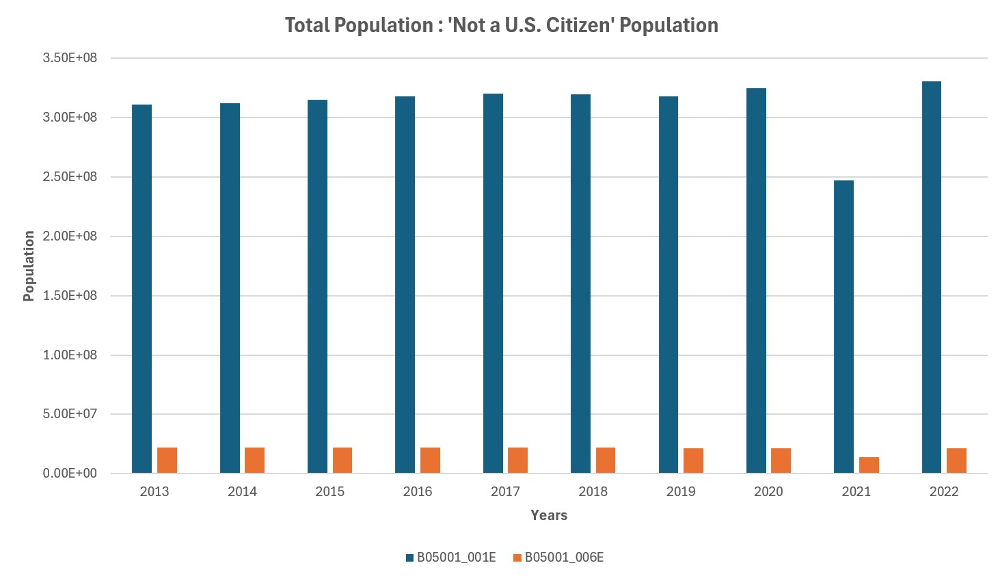

# Objective
To analyze trends in immigration and their impact on U.S. demographics, economy, and societal dynamics using US census and DHS data.

---
# Datasets

- **The American Community Survey (ACS5)**
- **Homeland Security Statistics (HSS), Yearbook 2023**

# Languages

- **Python**: Census Data Pull and Data Prepping  
- **Scala (Azure Databricks)**: Data Processing and Analysis  
- **Excel**: Vetting and Visualizations

# Message
I’m a dreamer, an immigrant, and someone who loves this country deeply. My intention with this project is not to spark political debate or discomfort, but to fulfill the goals of this Big Data project: to extract, process, and present meaningful insights from publicly available data.

# Why Did I Use These Datasets?
I chose these datasets because they provide comprehensive, reliable, and publicly available data on a variety of demographic, economic, and immigration-related metrics. They align with my project goal to analyze and present findings on the dynamics of immigration in the U.S. using trusted sources. Both data sources are readily accessible, straightforward to retrieve, and therefore well-suited for replication for peer review if necessary.

# What Are These Datasets?

### The American Community Survey (ACS5)
- The ACS is an annual survey conducted by the U.S. Census Bureau. It provides detailed demographic, social, economic, and housing data at various geographic levels, such as national, state, county, and smaller subdivisions.
- The nation’s most current, reliable, and accessible data source for local statistics on critical planning topics such as age, children, veterans, commuting, education, income, and employment.
- Surveys 3.5 million addresses and informs how trillions of federal funds are distributed each year.
- Covers 40+ topics and supports over 300 evidence-based Federal government uses.
- ACS5 is the most reliable, precise, and representative. It may be the least current, but when it comes to precision and reliability, ACS5 is the best dataset to use.
- The ACS5 dataset presents estimates of counts, averages, medians, proportions, and rates, derived from survey sampling and accompanied by margins of error (MOE) to quantify uncertainty.
- For more details please see [Census.gov | U.S. Census Bureau Homepage](https://www.census.gov/).
- **Note: ACS1 vs ACS5 vs Decennial Datasets:** ACS1 provides annual, timely estimates for larger populations (65,000+). ACS5 offers more reliable estimates with greater geographic granularity by combining five years of data, while the Decennial Census is a comprehensive population count every 10 years, serving as the baseline for apportionment and funding allocation.

### Homeland Security Statistics (HSS), Yearbook 2023
- The HSS Yearbook compiles immigration-related statistics, including lawful permanent residents, naturalizations, non-immigrant admissions, and enforcement actions. It is published by the Department of Homeland Security (DHS).
- The 2023 Yearbook of Immigration Statistics is a collection of tables about immigration for the fiscal year.
- For more details please see [About Our Data | OHSS - Office of Homeland Security Statistics](https://ohss.dhs.gov/).

---
# Data Decisions and Outline
- Identified limitations of the Census API and Python library in pulling complete datasets for all years, locations, and variables.
- Decided to extract as much data as possible for the targeted variables to ensure comprehensive analysis.
- Used Azure Databricks and Scala to implement custom data wrangling and processing for greater control and scalability.

- Chose to use **Spark SQL DataFrames** over Datasets or RDDs for processing due to:
  - Superior optimization capabilities via Spark’s Catalyst optimizer.
  - Simplified syntax and integration with SQL-like queries, enhancing productivity.
  - Better performance for structured and semi-structured data compared to RDDs.

# Data Pull and Prepping

### Initial Exploration
- Began by familiarizing myself with the census library in Python, including reviewing documentation, exploring the variable glossary, and running basic data pulls for one state and one variable at a time to understand the structure and capabilities of the dataset.

<details>
  <summary>Click to view code</summary>

```python
from census import Census
from us import states
import pandas as pd

# Your Census API key
API_KEY = "Enter Key" #Change as necessary

# Initialize the Census API
c = Census(API_KEY)

# Query ACS 5-Year Data for 2022
data = c.acs5.state(
    ('B05001_001E'),  # Total population
    '06'
)

# Convert to pandas DataFrame
df = pd.DataFrame(data)

# Save the results to a CSV file
output_file = "acs5_ca_data.csv"
df.to_csv(output_file, index=False)

# Explore the data
print(df)
```
</details>

### Scaling Up
- Progressed to pulling data for multiple variables, multiple counties, and multiple states across all available ACS5 years. This required writing more advanced and complex Python code to handle larger-scale data retrieval effectively.

**Insights from Expanded Data Pull:**
- Utilized the Census API and the `us` library to retrieve ACS5 data for all counties, states, and years.  
- A wide range of variables was included, selected based on personal interest and some chosen randomly.  
- Inconsistencies emerged where certain variables were missing for specific years, resulting in potential gaps in the final dataset.  
- The API proved unreliable at times, occasionally failing when too many variables were requested in a single pull.  
- The data retrieval process was time-intensive, taking approximately 5-6 hours to complete, highlighting a need for script optimization to improve efficiency or scaling down the variable list.  

- Extracted data into a large CSV file as the output of data preparation, opting for simplicity over using Parquet files.  
- **Output:** acs5_immigration_foreign_allyears_final.csv ~ 0.5gb  

# Data Processing and Analysis
### Main Script
- **Sourcing in Data**
<details>
  <summary>Click to view code</summary>

```scala
- Sourcing in Data
//////////////////////////////////
//////// Sourcing in Data ////////
//////////////////////////////////
import spark.implicits._
import org.apache.spark.sql.SparkSession

//////// Measure Start Time ////////
val startTime = System.nanoTime() //nano is more precised than milli.

// Reading in Data Files
val filepath_census = abfssBasePath + "Project_Data_Census_DHS/acs5_immigration_foreign_allyears_final.csv"
val filepath_dhs2 = abfssBasePath + "Project_Data_Census_DHS/DHS_table2_lawful_permanent_resident.csv"

val census = spark.read
                  .option("header", "true") // Use the first row as column names
                  .csv(filepath_census)
val dhslawful = spark.read
                .option("header", "true")
                .csv(filepath_dhs2)
```
</details>

- **Data Review - Validation**
<details>
  <summary>Click to view code</summary>

```scala
// Number of columns
val numColumns = census.columns.length
println(s"Number of census df columns: $numColumns")

// Number of rows
val numRows = census.count()
println(s"Number of census df rows: $numRows")

val datatypescensus = census.schema.fields.map(_.dataType)
                                    .distinct

// Print the unique data types
println("Unique data types in census df:")
datatypescensus.foreach(println)
```
</details>

- **Data Questions - Manual**
<details>
  <summary>Click to view code</summary>

```scala
val censuspop = census.select(
                              $"year",
                              $"state_name",
                              $"county_name",
                              $"B05001_001E",
                              $"B05002_001E"
                              )
                    .filter($"year" === 2022)
                    .filter($"state_name" === "Washington")
////////Census - Calculating the sum of B05001_001E at different levels////////
val totalcensuspop = census.filter($"year" === 2022)
                          .agg(sum($"B05001_001E").alias("total_us_population"))
                          .collect()(0)(0)
val totalpop = censuspop.agg(sum($"B05001_001E").alias("total_state_population"))
                        .collect()(0)(0) // Collecting the sum as a scalar value
```
</details>

- **Data Questions - Main Function**
<details>
  <summary>Click to view code</summary>

```scala
//////// Example Calls ////////
val resultUS = aggregateCensusData(
  census = census,
  year = 2022,
  variables = Seq("B05001_006E")
)
println(s"US-level aggregation: $resultUS")

val resultState = aggregateCensusData(
  census = census,
  year = 2022,
  stateName = Some("Oregon"),
  variables = Seq("B05001_001E", "B05001_006E")
)
println(s"State-level aggregation: $resultState")

val resultCounty = aggregateCensusData(
  census = census,
  year = 2022,
  stateName = Some("Washington"),
  countyName = Some("King County"),
  variables = Seq("B05001_001E", "B05001_006E")
)
println(s"County-level aggregation: $resultCounty")

```
</details>

### Population and Demographics

- **How does the foreign-born or 'Not a U.S. Citizen' population vary across different counties in the U.S. in 2022? (Census Data)**  
  - `B05001_001E` (Total population in the United States): `330 Million`  
  - `B05001_006E` (Total population in the United States, Not a U.S. citizen): `22 Million`  
    - `B05001_001E` (Total population in Washington State): `7.7 Million`  
    - `B05001_006E` (Total population in Washington State, Not a U.S. citizen): `590 Thousand`  
      - `B05001_001E` (Total population in King County): `2.3 Million`  
      - `B05001_006E` (Total population in King County, Not a U.S. citizen):  `291 Thousand`

<details>
  <summary>Click to view Bar Chart</summary>



</details>

- **What is the racial and ethnic breakdown of the Total population in the U.S.?**  
  - `B03002_003E` (White alone): TBD  
  - `B03002_004E` (Black or African American alone): TBD  
  - `B03002_005E` (American Indian and Alaska Native alone): TBD  
  - `B03002_006E` (Asian alone): TBD  
  - `B03002_012E` (Hispanic or Latino): TBD  
  ... There are more variables, race groups...
  ... After further vetting, I need to verify if those variables are correct ....

- **Persons obtaining lawful permanent resident status by country of last residence in 2017 and 2023: (DHS Data)**
    - 2017
      - Total: 1.1 Million  
        - Mexico: 168 Thousand  
        - Cuba: 64 Thousand  
        - China: 66 Thousand  
    - 2023
      - Total: 1.2 Million  
        - Mexico: 150 Thousand  
        - Cuba: 78 Thousand  
        - China: 55 Thousand  

---
# Looking Ahead

- **Validating Variables:** A deeper vetting process is required to ensure the selected Census variables align with the intended research questions and objectives.
- **Comprehensive Data Integration:** Incorporating all available data for the targeted locations, years, and variables to create a robust and inclusive dataset.
- **Expanding Data Analysis:** Developing and addressing additional questions focusing on areas such as Economic Impact, Education, Policy and Migration Trends, and Housing.
- **Enhanced Visualizations:** Translating data findings into clear, engaging visual narratives to better communicate insights and trends.

# Challenges and Roadblocks

- **Complexity of Census Data:** The Census API and datasets are more intricate than initially anticipated, requiring significant time to understand their structure and limitations.
- **Navigating Vast Variables:** With over 20,000 variables to explore, identifying and selecting the most relevant ones proved labor-intensive despite the availability of glossaries and documentation.
- **Coding and Optimization:** Automating processes and optimizing the code to handle large-scale data pulls posed ongoing challenges, especially in ensuring efficiency and reliability during execution.

---
# References
1. [Census Documentation 2022](https://www.census.gov/programs-surveys/acs/microdata/documentation/2022.html)  
2. [Census Data API Developer Guide](https://www.census.gov/data/developers.html)  
3. [Intro to Census Bureau Data API](https://www.census.gov/data/academy/courses/intro-to-the-census-bureau-data-api.html)  
4. [ACS5 Variables](https://api.census.gov/data/2022/acs/acs5/variables.html)  
5. [Python Census Library](https://pypi.org/project/census/)  
6. [DHS Yearbook of Immigration Statistics 2023](https://ohss.dhs.gov/topics/immigration/yearbook-immigration-statistics/yearbook-2023)  
7. [ACS Guidance on Estimates](https://www.census.gov/programs-surveys/acs/guidance/estimates.html)  
8. [ACS5 API Gateway](https://proximityone.com/apigateway_acs5year.htm)
